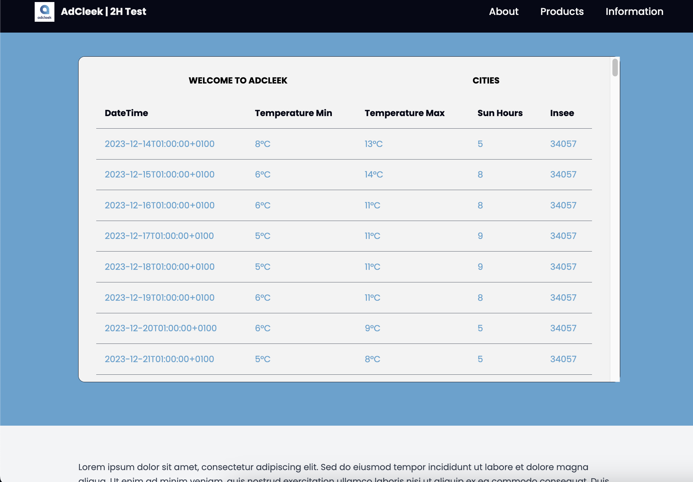

## AdCleek 2H Project with React Vite and Express
under node 18.2.0

### 🚀 Dependencies:

```bash
npm i -D tailwindcss postcss autoprefixer axios react-router-dom axios express body-parser concurrently cors@2.8.5 sqlite3@5.0.8
```

### 🏁 Run Server:
```bash
npm run dev
```

### 🔥 UI:

